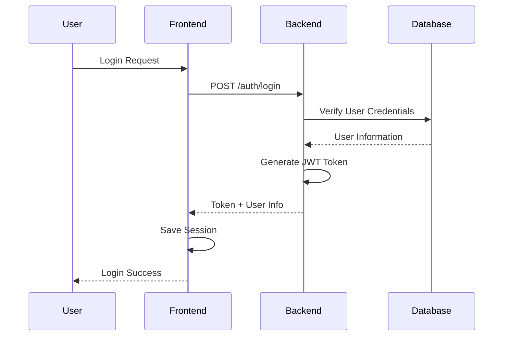
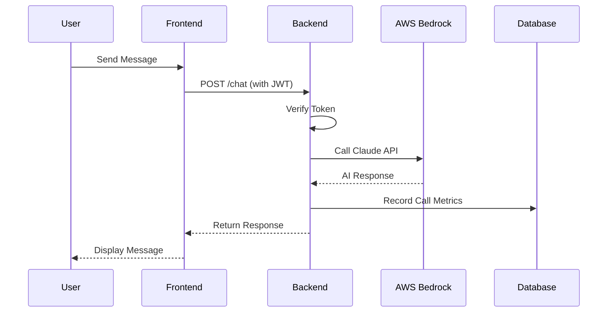
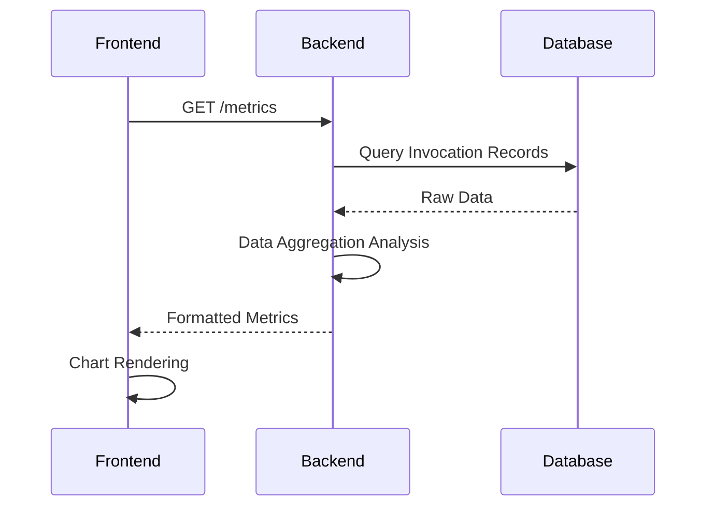

# 🏗️ System Architecture Documentation

## Overview

Bedrock Chatbot is an enterprise-grade full-stack AI application that adopts modern microservices architecture design, implementing front-end and back-end separation with complete authentication system and real-time monitoring functionality.

## Architecture Overview

### High-Level Architecture Diagram

```
┌─────────────────┐    ┌─────────────────┐    ┌─────────────────┐
│                 │    │                 │    │                 │
│   Frontend      │◄──►│   Backend       │◄──►│   AWS Bedrock   │
│   (Streamlit)   │    │   (Flask API)   │    │   (Claude AI)   │
│                 │    │                 │    │                 │
└─────────────────┘    └─────────────────┘    └─────────────────┘
         │                       │                       
         │                       │                       
         ▼                       ▼                       
┌─────────────────┐    ┌─────────────────┐              
│                 │    │                 │              
│   Session       │    │   SQLite        │              
│   Storage       │    │   Database      │              
│                 │    │                 │              
└─────────────────┘    └─────────────────┘              
```

## System Components

### 1. Frontend Layer

**Technology Stack:**
- **Streamlit**: Web application framework
- **Python 3.8+**: Programming language
- **Requests**: HTTP client library
- **Pandas**: Data processing
- **Plotly**: Data visualization

**Functional Modules:**
```
frontend/
├── app.py                 # Main application entry
├── components/
│   ├── auth.py           # Authentication components
│   ├── chat.py           # Chat interface
│   ├── dashboard.py      # Monitoring dashboard
│   └── utils.py          # Utility functions
└── static/
    ├── css/              # Style files
    └── js/               # JavaScript scripts
```

**Responsibilities:**
- User interface rendering
- User interaction handling
- API request encapsulation
- Session state management
- Data visualization display

### 2. Backend Layer

**Technology Stack:**
- **Flask**: RESTful API framework
- **Flask-JWT-Extended**: JWT authentication
- **bcrypt**: Password encryption
- **boto3**: AWS SDK
- **SQLite**: Lightweight database
- **SQLAlchemy**: ORM framework

**Service Modules:**
```
backend/
├── app.py                # Flask application main entry
├── auth.py               # Authentication service
├── bedrock_api.py        # AWS Bedrock integration
├── metrics.py            # Monitoring metrics service
├── models/
│   ├── user.py          # User data model
│   └── metrics.py       # Metrics data model
├── services/
│   ├── chat_service.py  # Chat business logic
│   └── admin_service.py # Administrative functions
└── utils/
    ├── db_utils.py      # Database utilities
    └── logger.py        # Logging utilities
```

**Responsibilities:**
- RESTful API provision
- Business logic processing
- Database operations
- External service integration
- Security authentication and authorization

### 3. Data Layer

**Database Design:**

#### Users Table
```sql
CREATE TABLE users (
    id INTEGER PRIMARY KEY AUTOINCREMENT,
    username VARCHAR(80) UNIQUE NOT NULL,
    email VARCHAR(120) UNIQUE,
    password_hash BLOB NOT NULL,
    created_at TIMESTAMP DEFAULT CURRENT_TIMESTAMP,
    last_login TIMESTAMP,
    is_active BOOLEAN DEFAULT 1
);
```

#### Invocations Table
```sql
CREATE TABLE invocations (
    id INTEGER PRIMARY KEY AUTOINCREMENT,
    timestamp TIMESTAMP DEFAULT CURRENT_TIMESTAMP,
    model_id VARCHAR(255) NOT NULL,
    input_tokens INTEGER,
    output_tokens INTEGER,
    response_time REAL,
    user_id INTEGER,
    FOREIGN KEY (user_id) REFERENCES users (id)
);
```

### 4. External Services Layer

#### AWS Bedrock Integration
```
┌─────────────────────────────────────┐
│           AWS Bedrock               │
├─────────────────────────────────────┤
│  • Claude-3 Sonnet                 │
│  • Claude-3 Haiku                  │
│  • Model Management                │
│  • Token Usage Tracking            │
└─────────────────────────────────────┘
```

**Integration Methods:**
- boto3 SDK calls
- IAM role authentication
- Regional configuration management
- Error retry mechanisms

## Data Flow Architecture

### 1. User Authentication Flow



### 2. Chat Interaction Flow



### 3. Monitoring Data Flow



## Deployment Architecture

### Development Environment

```
┌─────────────────┐    ┌─────────────────┐
│   Frontend      │    │   Backend       │
│   localhost:8501│◄──►│   localhost:5000│
└─────────────────┘    └─────────────────┘
         │                       │
         └───────────┬───────────┘
                     ▼
         ┌─────────────────┐
         │   Local SQLite  │
         │   Database      │
         └─────────────────┘
```

### Production Environment (Docker)

```
┌─────────────────────────────────────┐
│           Docker Host               │
├─────────────────────────────────────┤
│  ┌─────────────┐  ┌─────────────┐   │
│  │  Frontend   │  │   Backend   │   │
│  │  Container  │◄─┤  Container  │   │
│  │  :8501      │  │   :5000     │   │
│  └─────────────┘  └─────────────┘   │
│         │                │          │
│  ┌─────────────────────────────┐    │
│  │     Shared Volume       │    │
│  │     (Database & Logs)   │    │
│  └─────────────────────────────┘    │
└─────────────────────────────────────┘
```

### Container Orchestration

```yaml
# docker-compose.yml structure
services:
  backend:
    build: ./backend
    ports: ["5000:5000"]
    volumes: ["./data:/app/data"]
    environment: [...]
    
  frontend:
    build: ./frontend
    ports: ["8501:8501"]
    depends_on: ["backend"]
    environment: [...]
```

## Security Architecture

### Authentication and Authorization Flow

```
┌─────────────────┐
│   JWT Token     │
├─────────────────┤
│  Header:        │
│  - alg: HS256   │
│  - typ: JWT     │
├─────────────────┤
│  Payload:       │
│  - user_id      │
│  - username     │
│  - exp: 24h     │
├─────────────────┤
│  Signature:     │
│  - HMAC SHA256  │
└─────────────────┘
```

### Data Protection Layers

1. **Transport Layer Security**: HTTPS encryption
2. **Application Layer Security**: JWT Token verification
3. **Data Layer Security**: bcrypt password encryption
4. **Container Security**: Non-root user execution

## Performance Design

### Caching Strategy

```
┌─────────────────┐    ┌─────────────────┐
│   Application   │    │   Database      │
│   Cache         │    │   Connection    │
├─────────────────┤    │   Pool          │
│  • JWT Token   │    ├─────────────────┤
│  • User Info    │    │  • Connection   │
│  • Chat History │    │    Reuse        │
└─────────────────┘    │  • Transaction  │
                       │    Management   │
                       │  • Query        │
                       │    Optimization │
                       └─────────────────┘
```

### Concurrency Handling

- **Multi-threading Support**: Flask built-in WSGI server
- **Asynchronous Processing**: Async handling for long AI calls
- **Connection Pooling**: Database connection reuse
- **Resource Limits**: Memory and CPU usage control

## Scalability Design

### Horizontal Scaling

```
            ┌─────────────────┐
            │   Load Balancer │
            └─────────┬───────┘
                      │
        ┌─────────────┼─────────────┐
        ▼             ▼             ▼
┌─────────────┐ ┌─────────────┐ ┌─────────────┐
│ Backend #1  │ │ Backend #2  │ │ Backend #3  │
└─────────────┘ └─────────────┘ └─────────────┘
        │             │             │
        └─────────────┼─────────────┘
                      ▼
            ┌─────────────────┐
            │  Shared Database│
            └─────────────────┘
```

### Modular Expansion

- **Plugin Architecture**: New model adapters
- **API Versioning**: Backward compatibility
- **Configuration-Driven**: Runtime configuration updates
- **Monitoring Integration**: Third-party monitoring systems

## Monitoring and Logging

### Application Monitoring

```
┌─────────────────────────────────────┐
│           Monitoring Metrics        │
├─────────────────────────────────────┤
│  Business Metrics:                  │
│  • API Call Count                   │
│  • Response Time Distribution       │
│  • Error Rate Statistics            │
│  • User Activity                    │
├─────────────────────────────────────┤
│  System Metrics:                    │
│  • CPU/Memory Usage                 │
│  • Database Connections             │
│  • Disk I/O                        │
│  • Network Traffic                  │
└─────────────────────────────────────┘
```

### Logging Architecture

```
┌─────────────────┐    ┌─────────────────┐
│   Application   │    │   Access Logs   │
│   Logs          │    │                 │
├─────────────────┤    ├─────────────────┤
│  • ERROR        │    │  • HTTP Requests│
│  • WARNING      │    │  • Response     │
│  • INFO         │    │    Status       │
│  • DEBUG        │    │  • User IP      │
└─────────────────┘    │  • Timestamp    │
         │              └─────────────────┘
         │                       │
         └───────────┬───────────┘
                     ▼
         ┌─────────────────┐
         │   Log           │
         │   Aggregation   │
         │   (File/ELK)    │
         └─────────────────┘
```

## Disaster Recovery

### Backup Strategy

1. **Database Backup**: Daily automated backups
2. **Configuration Backup**: Version control management
3. **Container Images**: Multi-version retention
4. **Log Archiving**: Long-term storage strategy

### Failure Recovery

```
Failure Detection → Auto Restart → Service Degradation → Manual Intervention
    ↓               ↓              ↓                  ↓
Health Check     Container       Static Response    Full Recovery
                 Restart
```

## Technical Debt Management

### Code Quality

- **Unit Test Coverage**: > 80%
- **Code Style Check**: PEP 8 standards
- **Security Scanning**: Dependency vulnerability checks
- **Performance Analysis**: Regular performance benchmarking

### Dependency Management

- **Version Locking**: Exact versions in requirements.txt
- **Security Updates**: Regular dependency updates
- **Compatibility Testing**: Multi-Python version support
- **License Compliance**: Open source license review

---

*This architecture document will be continuously updated and maintained as the system evolves.* 